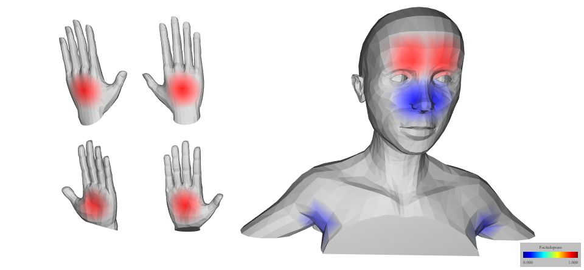

# UntargetedMS-Drugs-Skin

Material and code used to analyze untargeted mass spectrometry data intending to detect drugs from human skin accompanying the manuscript. The code is written in R using Jupyter Notebooks.

*Figure generated using ['ili](https://github.com/MolecularCartography/ili) illustrating the detection (red) of escitalopram on the skin of a subject in this study at multiple body location.*
